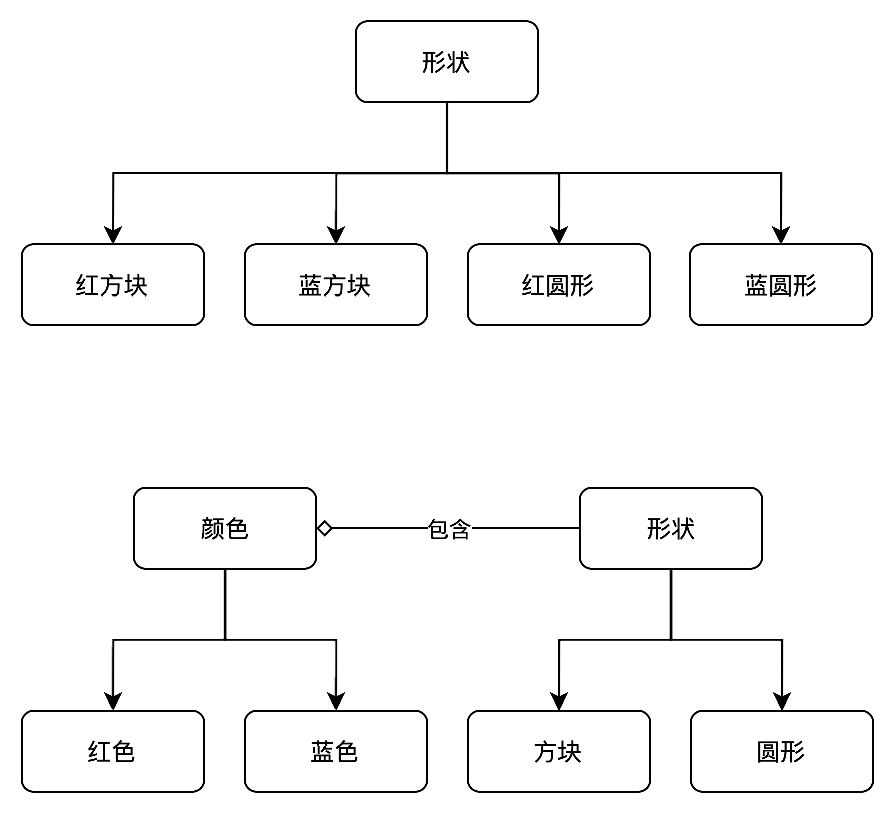

# 桥接模式
桥接模式是一种结构型设计模式，它将抽象和现实解耦，让它们可以独立变化。简单理解就是将抽象和具体的东西通过桥接的方式关联起来，保存了之间的关系，但是又不影响拓展。
## 解决的问题
假设有一个几何类Shape类，有两个拓展的子类圆Circle和方形Square，如果对于这样的父子结构关系中加入两种颜色，即红方块，蓝方块...如果覆盖所有的子类，至少出现四个类来描述所有的组合，如果新增颜色和模块会相互继承关系  
这个问题的所在是通过两种不通纬度来拓展Shape类，桥接模式将两种纬度通过组合的方式解耦，具体形式如下：

如图所示，颜色单独抽离出来，在形状类中添加了某一颜色的引用成员变量。现在形状类可以将所有与颜色相关的工作委派给引用的颜色对象。这样的引用成为了形状和颜色的桥梁，后面两者新增子类将不在影响对方。  
### 例子
假设现在有设备父类和遥控器父类，遥控器类可以支持多设备遥控，该如何实现  
首先有一个设备父类Device，可以换台和调整音量，Tv 和 Radio实现Device接口
```Java 
interface Device {

    // 设置音量
    void setVolume(Integer percent);

    // 调台
    void setChannel(String channel);

    // 获取音量
    Integer getVolume();

    // 获取频道
    String getChannel();

    // 其他功能
    // ...

}
class Tv implements Device{

    private Integer volume;

    private String channel;

    @Override
    public void setVolume(Integer percent) {
        this.volume = percent;
    }

    @Override
    public void setChannel(String channel) {
        this.channel = channel;
    }

    @Override
    public Integer getVolume() {
        return this.volume;
    }

    @Override
    public String getChannel() {
        return this.channel;
    }
}

class Radio implements Device{

    private Integer volume;

    private String channel;

    @Override
    public void setVolume(Integer percent) {
        this.volume = percent;
    }

    @Override
    public void setChannel(String channel) {
        this.channel = channel;
    }

    @Override
    public Integer getVolume() {
        return this.volume;
    }

    @Override
    public String getChannel() {
        return this.channel;
    }
}
```
有一个遥控器类RemoteControl，提供了基础的换台和加减音量功能，同时为了支持多个设备，添加了对设备接口的引用
```Java
class RemoteControl {
    private final Device device;

    RemoteControl(Device device) {
        this.device = device;
    }

    public void volumeUp(){
        device.setVolume(device.getVolume() + 2);
    }

    public void volumeDown(){
        device.setVolume(device.getVolume() - 2);
    }

    public void setChannel(String channel){
        device.setChannel(channel);
    }
}
```
还可以实现一些高级的遥控器，比如带小屏幕显示电视现在是哪个台，什么音量，语音换台等
```Java
class AdvancedRemoteControl extends RemoteControl{

    AdvancedRemoteControl(Device device) {
        super(device);
    }

    public void showDetail(){
        System.out.println(super.device.getChannel() + super.device.getVolume());
    }

    public void voiceSetChannel(String voice){
        // voice 转换 channel
        String channel = voice;
        super.device.setChannel(channel);
    }
}
```
通过构造器将遥控器和设备桥接后，后续新的设备只需要实现了Device类就可以被RemoteControl所遥控，具体使用如下：
```Java
package com.ymplans.patterns.bridge;

/**
 * 桥接模式
 *
 * @author Jos
 */
public class Bridge {
    public static void main(String[] args) {
        Device tv = new Tv();
        RemoteControl remoteControl = new RemoteControl(tv);

        Device radio = new Radio();
        AdvancedRemoteControl advancedRemoteControl = new AdvancedRemoteControl(radio);
    }
}
```
## 实现方式
桥接模式属于实现较为简单，理解较难的一种模式，具体实现就是如果一个类有一个或者多个独立变化的维度，可以通过组合的方式，让多个维度独立进行拓展，换一句话说就是通过组合关系替代继承关系，避免继承层次指数级爆炸，让两个维度通过桥接来关联。

## 优缺点
- 优点 
  - 遵循开闭原则，可以新增抽象和实现部分两者不会相互影响
  - 对于实现部分的具体内容可以忽略，只需要通过抽象部分进行调用（设备的具体实现忽略，只关心遥控器如何控制）
  - 遵循单一职责原则，抽象部分处理高层次逻辑，实现部分处理实现细节
- 缺点
  - 设计抽象和实现较为困难，较难理解层次结构
## 适用场景
- 一个类存在两个或者多个独立变化的维度
- 解决复杂的继承关系