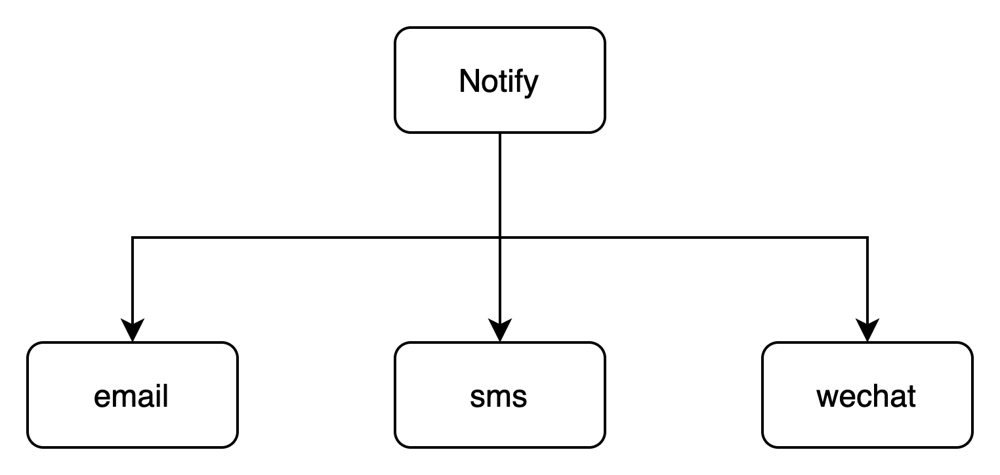

# 装饰器模式
装饰器模式是一种结构型模式，允许通过将对象放入包含行为的特殊封装对象中来为原对象绑定新的行为
## 解决的问题
如果现在开发一个通知功能的代码库，可以很自然的想到面向接口编程，提供发送消息的接口，将抽象和实现分开，根据发送短信，发送邮件，发送微信来完成不同的实现。

这样看起来很好，我们可以通过Notify接口调用到不通方式的消息通知。但是此时问题来了，我希望同时收到邮箱和短信的通知，那需要再创建一个特殊的实现，但是这样的特殊实现还有邮箱+微信，邮箱+微信+短信...具体实现数量爆炸起来。如何解决这样的问题呢，也就是装饰器模式，来看看具体实现：
```Java
package com.ymplans.patterns.decorator;

/**
 * 通知接口
 *
 * @author Jos
 */
public interface Notify {
    public void send(String message);
}

class BaseEmailNotify implements Notify{

    @Override
    public void send(String message) {
        System.out.println("邮件发送：" + message);
    }
}

class SmsDecorator implements Notify{

    private final Notify notify;

    public SmsDecorator(Notify notify) {
        this.notify = notify;
    }

    public void send(String message) {
        this.notify.send(message);
        System.out.println("短信发送：" + message);
    }
}

class WechatDecorator implements Notify{
    private final Notify notify;

    public WechatDecorator(Notify notify){
        this.notify = notify;
    }

    @Override
    public void send(String message) {
        this.notify.send(message);
        System.out.println("微信发送：" + message);
    }
}

class Main{
    public static void main(String[] args) {
        Notify baseEmailNotify = new BaseEmailNotify();
        baseEmailNotify.send("Hi!");

        WechatDecorator wechatDecorator = new WechatDecorator(baseEmailNotify);
        wechatDecorator.send("Java!");

        Notify smsDecorator = new SmsDecorator(baseEmailNotify);
        smsDecorator.send("Hello!");

        Notify aWechatDecorator= new WechatDecorator(smsDecorator);
        aWechatDecorator.send("World!");
    }
}
```
运行结果：
```Java
邮件发送：Hi!
邮件发送：Java!
微信发送：Java!
邮件发送：Hello!
短信发送：Hello!
邮件发送：World!
短信发送：World!
微信发送：World!
```
假设邮件发送是基础功能，我可以随意的通过装饰器来实现功能的增强，绑定了新的发送消息行为，也减少了特殊实现的出现。这也是装饰器模式带来的最直观感受
## 实现方式
装饰器模式的核心就是将继承关系设计成了组合关系，在上面问题中将特殊组合的实现，通过装饰器来实现组合关系，装饰器实现了被装饰对象相同的接口，而装饰器可以引用遵循相同接口的任意对象作为成员变量来实现组合关系。

## 优缺点
- 优点 
  - 无需创建新子类即可完成拓展
  - 可以在运行过程中增强功能
  - 遵循单一职责原则，将完成了多种行为的类拆分了单个行为的类
- 缺点
  - 不好删除指定装饰器
  - 实现的行为受装饰器顺序的影响
## 适用场景
- 运行时对对象增加额外的行为
- 当继承不能拓展对象行为时