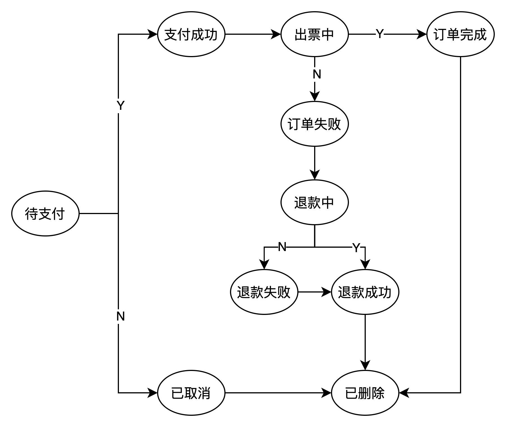

# 状态模式
状态模式是一种行为设计模式，它能在一个对象的内部状态变化时改变其行为，使其看上去就像改变了自身所属的类一样。

## 解决的问题
对于票务订单有以下状态的变化： 

上图的状态有很多，其中也包含着一些复杂的业务，例如对接票务系统，对接支付系统等，这个状态图实际上是一个有限状态机，简称为状态机，状态机有三个组成部分
- 状态 （State）
- 事件  (Event)
- 动作  (Action)  
  
事件也称之为转移条件，事件触发状态的转移以及动作的执行，动作不是不是必须的，也可能只转移状态。 例如支付成功后既包括状态的变化，也包括支付结果的记录动作。而订单自动取消只将订单状态进行了更改。 
对于状态机有三种解决的方法
### 分支逻辑法
分支逻辑法其实就是通过if-else来进行进行分支逻辑的判断，通过判断事件（Event）和当前状态（State）进行动作（Action），但分支逻辑法只适合简单的状态机，如果状态机比较复杂非常容易错写和漏写某个状态转移，而且还使用着大量的if-else让代码的可读性和可维护性很差。如果引入新的状态修改起来会很难
### 查表法
查表法实际上是使用一个二维表将事件和状态作为两个维度，其值是当前状态经过该事件后，转移到新的状态以及相关的动作。但是对于动作很复杂，例如写数据库，发送消息。查表法会有局限性。
### 状态模式 
状态模式通过事件触发的状态转移和动作执行，拆分到不同的状态类中，对于上面的票务订单的状态机，使用状态模式可以很好做到状态管控。具体实现如下：

## 实现方式
### 状态接口
上面的票务订单，我们可以定义状态的事件：成功事件和失败事件
```Java
package com.ymplans.patterns.status.order;

/**
 * @author Jos
 */
public interface OrderStatus {
    String getName();
    void doSuccess();
    void doFailed();
}
```
### 上下文
在订单上下文中主要实现了状态的初始化，并代理了状态的成功事件动作和失败事件动作
```Java
package com.ymplans.patterns.status.order;

import com.ymplans.patterns.status.order.status.PendingPay;

/**
 * @author Jos
 */
public class OrderContext {

    private OrderStatus orderStatus;

    public OrderContext(){
        this.orderStatus = new PendingPay(this);
    }

    public void successAction(){
        this.orderStatus.doSuccess();
    }

    public void failedAction(){
        this.orderStatus.doFailed();
    }

    public void setOrderStatus(OrderStatus orderStatus) {
        this.orderStatus = orderStatus;
    }

    public String getOrderStatus() {
        return orderStatus.getName();
    }
}
```
### 状态实现
状态具体实现是状态经过了成功失败事件执行了哪些具体的动作，由于状态有很多，文中只实现了一个PendingPay状态（其他的见项目工程代码）可以看先doSuccess中进行了更新数据库的业务操作，并将上下文中的状态更新为支付成功并将上下文进行了传递
```Java
package com.ymplans.patterns.status.order.status;

import com.ymplans.patterns.status.order.OrderContext;
import com.ymplans.patterns.status.order.OrderStatus;

/**
 * @author Jos
 */
public class PendingPay implements OrderStatus {

    private final OrderContext orderContext;

    public PendingPay(OrderContext orderContext) {
        this.orderContext = orderContext;
    }

    @Override
    public String getName() {
        return "待支付";
    }

    @Override
    public void doSuccess() {
        System.out.println("更新数据库状态为支付成功");
        orderContext.setOrderStatus(new PaySuccess(this.orderContext));
    }

    @Override
    public void doFailed() {
        System.out.println("更新数据库状态为已取消");
        orderContext.setOrderStatus(new OrderCancel(this.orderContext));
    }
}
```
### 实现调用
当所有状态定义好后，可以模拟各种业务流程来控制状态的更新
```Java
package com.ymplans.patterns.status;

import com.ymplans.patterns.status.order.OrderContext;

/**
 * @author Jos
 */
public class StatusExample {

    public static void main(String[] args) {
        System.out.println("-------成功订单流程---------");
        successOrder();
        System.out.println("-------支付失败订单流程---------");
        payFailedOrder();
        System.out.println("-------出票失败成功退款流程---------");
        ticketFailedPayRefundOrder();
        System.out.println("-------出票失败退款失败流程---------");
        ticketFailedRefundFailedOrder();
    }

    private static void ticketFailedRefundFailedOrder() {
        System.out.println("订单初始化");
        OrderContext orderContext = new OrderContext();
        System.out.println("接收到订单支付成功结果");
        orderContext.successAction();
        System.out.println("调用票务系统出票");
        orderContext.successAction();
        System.out.println("票务系统出票失败");
        orderContext.failedAction();
        System.out.println("发起退款流程");
        orderContext.failedAction();
        System.out.println("用户删除了订单");
    }

    private static void ticketFailedPayRefundOrder() {
        System.out.println("订单初始化");
        OrderContext orderContext = new OrderContext();
        System.out.println("接收到订单支付成功结果");
        orderContext.successAction();
        System.out.println("调用票务系统出票");
        orderContext.successAction();
        System.out.println("票务系统出票失败");
        orderContext.failedAction();
        System.out.println("发起退款流程");
        orderContext.successAction();
        System.out.println("接受到支付系统退款成功");
        orderContext.successAction();
        System.out.println("用户删除了订单");
        orderContext.successAction();
    }

    private static void payFailedOrder() {
        System.out.println("订单初始化");
        OrderContext orderContext = new OrderContext();
        System.out.println("接收到订单支付失败结果，用户超时未支付");
        orderContext.failedAction();
        System.out.println("用户删除了订单");
        orderContext.successAction();
    }

    public static void successOrder(){
        System.out.println("订单初始化");
        OrderContext orderContext = new OrderContext();
        System.out.println("接收到订单支付成功结果");
        orderContext.successAction();
        System.out.println("调用票务系统出票");
        orderContext.successAction();
        System.out.println("票务系统出票成功");
        orderContext.successAction();
        System.out.println("用户删除了订单");
        orderContext.successAction();
    }

}
```
最后执行结果为：
```
-------成功订单流程---------
订单初始化
接收到订单支付成功结果
更新数据库状态为支付成功
调用票务系统出票
更新数据库为出票中
票务系统出票成功
保存票据系统下发的票，更新数据库状态
用户删除了订单
规则校验，订单逻辑删除
-------支付失败订单流程---------
订单初始化
接收到订单支付失败结果，用户超时未支付
更新数据库状态为已取消
用户删除了订单
校验订单，逻辑删除订单
-------出票失败成功退款流程---------
订单初始化
接收到订单支付成功结果
更新数据库状态为支付成功
调用票务系统出票
更新数据库为出票中
票务系统出票失败
更新数据库订单失败
发起退款流程
发起退款流程成功, 更新数据库状态
接受到支付系统退款成功
退款成功，更新数据库状态
用户删除了订单
规则校验，订单逻辑删除
-------出票失败退款失败流程---------
订单初始化
接收到订单支付成功结果
更新数据库状态为支付成功
调用票务系统出票
更新数据库为出票中
票务系统出票失败
更新数据库订单失败
发起退款流程
发起退款失败，再发起退款
发起退款流程成功, 更新数据库状态
用户删除了订单
```

## 适用的场景
- 对象需要根据自身的状态进行不同的行为
- 当相似状态和基于条件的状态机转换中存在重复代码时

## 优缺点
- 优点 
  - 单一职责原则 将特定状态相关的代码放在单独的类中
  - 开闭原则 无需修改已有状态类和上下文就能引入新状态
- 缺点
  - 代码结构变的复杂
  - 特殊事件或者事件的修改对需要对所有的状态进行实现无论状态是否会被事件触发动作