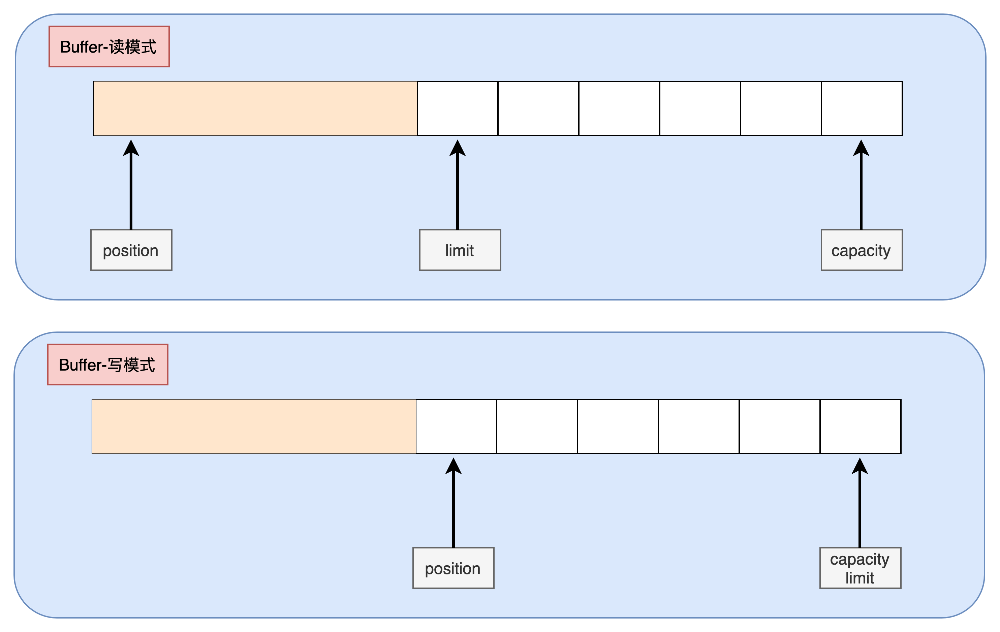

# Buffer 
`Buffer`是与`Channel`进行交互的，`Buffer`可以通过`Channel`写入或者读取数据，`Buffer`的本质就是一个内存块，只不过`Buffer`类对内存块进行了封装，让我们更好的使用内存块来进行数据的读写。
## 常见的Buffer
在`Java NIO`中有以下常见的`Buffer`类型
- ByteBuffer
- MappedByteBuffer
- CharBuffer
- DoubleBuffer
- FloatBuffer
- IntBuffer
- LongBuffer
- ShortBuffer
  
可以看到这些`Buffer`处理着不同的数据类型，包括`byte、char、double、float、int、long、short`类型
## Buffer如何使用
在使用Buffer读取数据基本上要进行以下步骤：
1. 写入数据到Buffer
2. 调用`buffer.filp()`
3. 从Buffer读取数据
4. 调用`buffer.clear()` 或者 `buffer.compact()`

Buffer 有两种模式 **读模式** 和 **写模式**  
在写模式下，Buffer会记录写入的数据，如果想要读取Buffer中的数据，需要调用`buffer.filp()`方法切换到读模式，当完成读操作，可以通过`buffer.clear()`(清除buffer)或者`buffer.compact()`(buffer压缩)方法进行写模式的切换，继续往buffer中写入数据。  


## Buffer的数据结构
`Buffer`本质上是一个可以读写的内存空间，然后被`Buffer`对象进行包装，提供一些方便的接口来让我们使用这个内存空间.  
`Buffer`有三个需要知道的属性，
- capacity 
- position
- limit

`position`和`limit`决定了`Buffer`是读模式还是写模式，`capacity`是`Buffer`的大小不会被读写模式影响

如图所示，当在读模式时，`position`和`limit`之间是`buffer`已经存储的数据，写模式时，两者之间是空的可写内存空间


## Buffer的常用方法
### 分配缓冲区
要想使用`Buffer`首先需要对其进行分配内存，所有的`Buffer`都有一个`allocate()`静态方法来进行内存空间的初始化。
```Java
// 初始化容量为20的ByteBuffer
ByteBuffer buffer = ByteBuffer.allocate(20);
// 初始化容量为20的IntBuffer
IntBuffer buffer = IntBuffer.allocate(20);
```

### 写入数据到Buffer
往`Buffer`写入数据除了从Channel中读，还可以主动写入数据
```Java
// 从channel中读取数据写入buffer
int read = channel.read(buffer);
// 主动写入数据, put()方法还有其他重载方法
buffer.put(96);
```
### 读模式切换
`flip()`可以将`Buffer`切换到读模式，这也意味着`limit`会设置成`position`的值，`position`重置为0

### 从Buffer中读取数据
读取数据可以将`Buffer`中的数据读入到`Channel`中也可以手动读取
```Java
// 读取buffer数据写入channel
int write = channel.write(buffer);
// 主动读取数据，get()方法有其他重载方法 
byte aByte = buffer.get()
```
### 写模式切换(清除和压缩)
当我们在读模式时，可以调用`clear()` 和 `compact()` 两个方法来进行写模式切换
```Java
// 清空buffer的数据，position 归0, limit 置为 capacity的值
buffer.clear();

// 当还有一些数据没有读完，但是又想立刻进入写模式，可以调用此方法
// 这时会把没有读完的数据移到开头，position会移到最后一个未读数据之后，limit设置成capacity大小
buffer.compact();
```
### 标记、重置、回滚
标记、重置、回滚是读模式下的三个方法，标记是在读模式时调用`mark()`就会将`position`的位置进行记录，当调用重置`reset()`时，`position`会重新回到标记的位置，可以达到循环读取。回滚则是将`position`重置回0，并保持读模式。

### 代码示例
```Java
package com.ymplans.buffer;

import java.nio.ByteBuffer;

/**
 * buffer方法示例程序
 *
 * @author Jos
 */
public class BufferMethodExample {

    public static void main(String[] args) {
        // 生成一个10个字节大小空间ByteBuffer对象
        ByteBuffer buffer = ByteBuffer.allocate(10);
        showBuffer(buffer, "buffer 初始化后：");
        // 写入一个数据
        buffer.put((byte) 65);
        showBuffer(buffer, "buffer 写入一个数据后：");
        // 写入byte数组
        buffer.put(new byte[]{97,98,99,100,101});
        showBuffer(buffer, "buffer 写入一个数组后：");
        // 读模式切换
        buffer.flip();
        showBuffer(buffer, "buffer 切换读模式后：");
        // 读取一个数据
        System.out.println("获取了数据为： " + buffer.get());
        showBuffer(buffer, "buffer 读取一个数据后：");
        // 读取指定数据, 不影响position
        System.out.println("获取了数据为： " + buffer.get(2));
        showBuffer(buffer, "buffer 读取指定数据后：");
        buffer.mark();
        buffer.get();
        showBuffer(buffer, "buffer 调用mark并读取一个数据后：");
        buffer.reset();
        showBuffer(buffer, "buffer 调用reset后：");
        buffer.rewind();
        showBuffer(buffer, "buffer 调用rewind后：");
        buffer.get();
        buffer.compact();
        showBuffer(buffer, "buffer 读取一个数据，并调用compact后：");
    }

    private static void showBuffer(ByteBuffer buffer, String msg) {
        System.out.println(msg);
        System.out.printf("position:  %d,\tlimit:  %d,\tcapacity:  %d%n", buffer.position(), buffer.limit(), buffer.capacity());
    }
}
```
运行结果
```
buffer 初始化后：
position:  0,	limit:  10,	capacity:  10
buffer 写入一个数据后：
position:  1,	limit:  10,	capacity:  10
buffer 写入一个数组后：
position:  6,	limit:  10,	capacity:  10
buffer 切换读模式后：
position:  0,	limit:  6,	capacity:  10
获取了数据为： 65
buffer 读取一个数据后：
position:  1,	limit:  6,	capacity:  10
获取了数据为： 98
buffer 读取指定数据后：
position:  1,	limit:  6,	capacity:  10
buffer 调用mark并读取一个数据后：
position:  2,	limit:  6,	capacity:  10
buffer 调用reset后：
position:  1,	limit:  6,	capacity:  10
buffer 调用rewind后：
position:  0,	limit:  6,	capacity:  10
buffer 读取一个数据，并调用compact后：
position:  5,	limit:  10,	capacity:  10
```
从`Channel`读写数据到`Buffer`的实例见[Channel](Channel.md)这篇文章