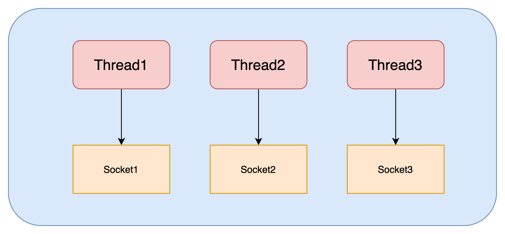
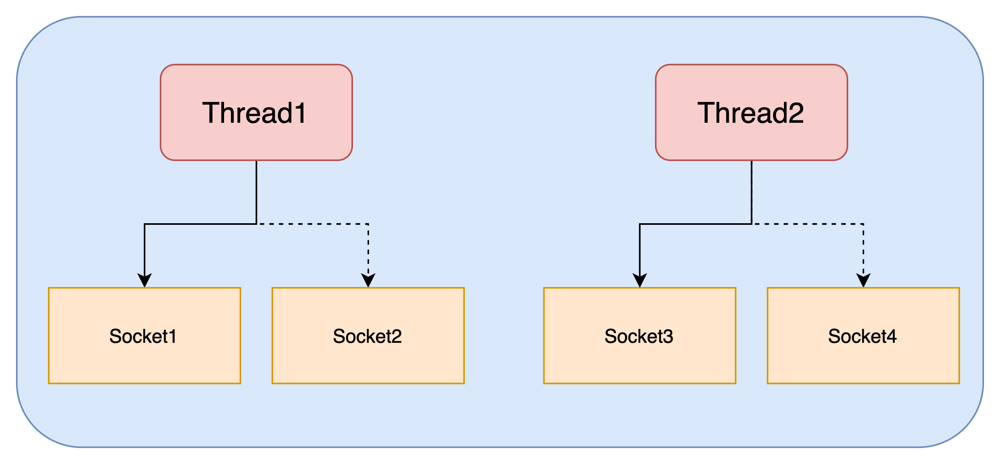
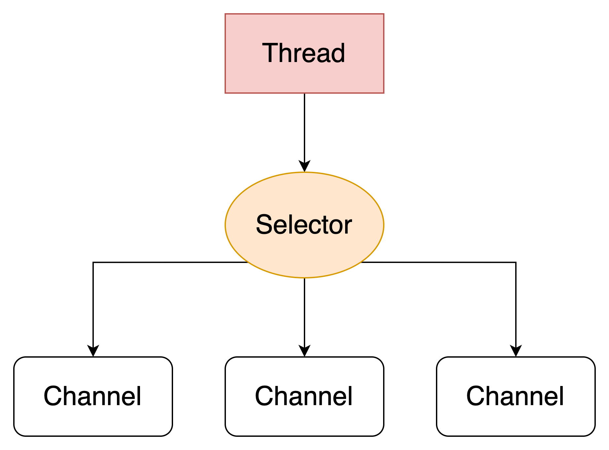

# Selector
在`Java NIO`中，`Selector`是一个管理一个或者多个`Channel`实例，监测哪个`Channel`已经是准备好读或者写，通过`Selector`可以让单个线程管理多个`Channel`，进而管理多个网络连接。


## 通过服务端设计理解Selector

### 多线程设计
服务器端以多线程处理客户端的连接，示意图如下：

当客户端发起多个连接，开启多个线程处理客户端请求，但是这样的设计的在连接数比较少时影响不大，但是客户端过多时会导致线程过多，让服务器的内存占用非常高，同时CPU在不同线程之间频繁进行切换导致性能低。  
### 线程池设计
如果限制线程数量，引入线程池，示意图如下：

线程池控制了线程的数量，并减少了上下文切换的频率，但是在这种实现方式下，如果在阻塞模式下，一个线程只能处理一个客户端，所以同时处理客户端的数量和线程数量一样，所以线程池的设计只适合短连接的场景
### Selector设计
Selector的设计如下图所示，一个线程为Selector服务，Selector可以保持阻塞模式下监听各个Channel发生的读写事件，而Channel处于非阻塞模式，不会阻塞线程。但是这种设计适合多连接，低流量的场景，因为如果一个Channel持续处理读写，那么会让其他Channel会一直处于等待。


## Selector的使用

### 创建Selector
Selector可以通过调用`Selector.open()`方法来创建
```Java
Selector selector = Selector.open();
```
### 注册Channel到Selector
刚刚说到在Selector设计中，Channel必须是非阻塞的，所以注册的Channel必须要支持非阻塞
```Java
SocketChannel socketChannel = SocketChannel.open();
Selector selector = Selector.open();
// 设置为非阻塞模式
socketChannel.configureBlocking(false);
SelectionKey selectionKey = socketChannel.register(selector, SelectionKey.OP_READ);
```
SocketChannel可以调用configBlocking()方法来设置阻塞，然后调用SocketChannel的注册方法register与Selector想关联，register方法的第二个参数表示Selector会监听SocketChannel的什么事件，具体有以下四种事件
- Connect 连接就绪事件，对应的常量为SelectionKey.OP_CONNECT
- Accept 接受就绪事件，对应的常量为SelectionKey.OP_ACCEPT
- Read 读就绪事件，对应的常量为SelectionKey.OP_READ
- Write 写就绪事件，对应的常量为SelectionKey.OP_WRITE
  
四种事件可以进行或运算，组成多种监听集合

### SelectionKey
在Channel注册会返回一个SelectionKey对象，这个对象里面包含着一些信息
- 监听的对象集合
- 就绪的事件集合
- Channel对象
- Selector对象
- 附加的对象

#### 监听的对象集合
可以通过监听的对象即可获取到Selector监听了哪些对象
```
int interestSet = selectionKey.interestOps();

boolean isInterestedInAccept  = SelectionKey.OP_ACCEPT  == (interests & SelectionKey.OP_ACCEPT);
boolean isInterestedInConnect = SelectionKey.OP_CONNECT == (interests & SelectionKey.OP_CONNECT);
boolean isInterestedInRead    = SelectionKey.OP_READ    == (interests & SelectionKey.OP_READ);
boolean isInterestedInWrite   = SelectionKey.OP_WRITE   == (interests & SelectionKey.OP_WRITE);
```
#### 就绪的监听集合
可以获取到监听的Channel有哪些事件已经就绪，或者获取到哪个类型事件已经已经就绪
```
int readyOps = selectionKey.readyOps();  // 就绪集合和监听类型集合一样可以进行运算得知就绪事件
// 直接获取事件是否就绪
selectionKey.isAcceptable();
selectionKey.isConnectable();
selectionKey.isReadable();
selectionKey.isWritable();
```

#### Channel&Selector对象
可以通过SelectionKey简单获取到Channel对象和Selector对象
```
Channel  channel  = selectionKey.channel();
Selector selector = selectionKey.selector();    
```

#### 附加的对象
可以通过附加信息可以进一步的识别Channel，或者更加方便的附加一些需要传输的信息，比如需要使用的Buffer或者一些带有业务价值的对象信息。附加对象由两种方法
1. selectionKey.attach(theObject); 
2. SelectionKey selectionKey = channel.register(selector, SelectionKey.OP_READ, theObject);
可以通过 `Object attachedObj = selectionKey.attachment();` 来获取

### 监听Channel
当注册了多个Channel到Selector上，可以通过select()方法获取到已经准备就绪的事件，select方法有以下实现：
- int select() 阻塞方法，直到至少一个已经注册的Channel事件已经就绪。
- int select(long timeout) 和select方法一样也是阻塞方法，直到timeout毫秒后不阻塞
- int selectNow() 非阻塞方法，会立即返回准备好的channel

返回值int代表着有多少个channel已经准备好，代表着自上一次select调用这段时间一共有多少channel已经准备好

### 获取channel
上文中Selector和Channel的关系保存在SelectionKey中，Selector自身也维护着三个Key集合
- RegisteredKey集合  
  已经注册的集合保存着所有与Selector关联的Channel所产生的Key
- SelectedKey集合  
  保存着Channel已经就绪的Key集合，当我们Select返回了大于等于1的值，可以通过这个集合获取到就绪的Channel
- CancelledKey集合  
  保存着调用了cancel()方法的Key，表示这个Key已经无效化，在下一次Select()时，这个集合的Key才会被注销，并将连接关，同时这个集合是一个私有变量不能直接获取，已经失效的Key可以通过isValid()来进行判断。

```Java
Set<SelectionKey> selectedKeys = selector.selectedKeys();

Iterator<SelectionKey> keyIterator = selectedKeys.iterator();

while(keyIterator.hasNext()) {
    
    SelectionKey key = keyIterator.next();

    if(key.isAcceptable()) {
        // 连接被允许

    } else if (key.isConnectable()) {
        // 与远端服务连接上

    } else if (key.isReadable()) {
        // channel可读

    } else if (key.isWritable()) {
        // channel可写
    }

    keyIterator.remove();
}
```
### 停止select
当select()阻塞时，如果想唤醒阻塞的线程可以通过以下两个方法实现
- wakeup()方法 让阻塞的select方法立即返回
- close()方法 将被阻塞的线程唤醒，并让所有注册的Channel注销，将所有的键也取消，但不关闭Channel本身
  
### 示例代码
```Java
Selector selector = Selector.open();

channel.configureBlocking(false);

SelectionKey key = channel.register(selector, SelectionKey.OP_READ);


while(true) {

  int readyChannels = selector.selectNow();

  if(readyChannels == 0) continue;


  Set<SelectionKey> selectedKeys = selector.selectedKeys();

  Iterator<SelectionKey> keyIterator = selectedKeys.iterator();

  while(keyIterator.hasNext()) {

    SelectionKey key = keyIterator.next();

    if(key.isAcceptable()) {
        // a connection was accepted by a ServerSocketChannel.

    } else if (key.isConnectable()) {
        // a connection was established with a remote server.

    } else if (key.isReadable()) {
        // a channel is ready for reading

    } else if (key.isWritable()) {
        // a channel is ready for writing
    }

    keyIterator.remove();
  }
}
```